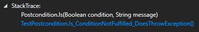

miniContract
===================

miniContract is an ultra light-weight library to express code contracts in .NET. It exists, because it's developers switched to Visual Studio 2017 and needed a simple solution to replace Code Contracts. It is extremely KISS. In fact it consists of merely five classes.

It is designed so that the stacktrace resulting from a contract violation contains only one line of miniContract.
 

It is also purposely very code centric, providing only a hand full of individual expressions.

At the moment, invariants are not supported, but they will be added in the future.

Examples of Usage
-----

    // free conditions
    Precondition.Is(true);    
    Precondition.Is(true, "Custom message");
    
    // individual expressions
	Precondition.NotNull(anObject);
	Precondition.NotNull(anObject, "Custom message");
    Precondition.NotDefault(42);
    Precondition.NotDefault(true, "Custom message");    

For more usage examples, check the [tests](https://github.com/jason-wilmans/miniContract/tree/master/Code/MiniContract/Tests).
